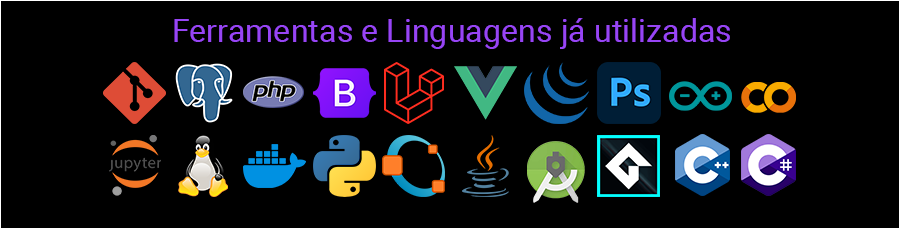

 

## Bem vindo ao meu Perfil!
Olá! 👋 Sou Henrique Hyonemoto, um entusiasta de tecnologia e da arte. Aqui, você encontrará uma combinação dos meus projetos em desenvolvimento, design e muito mais!

 

 

